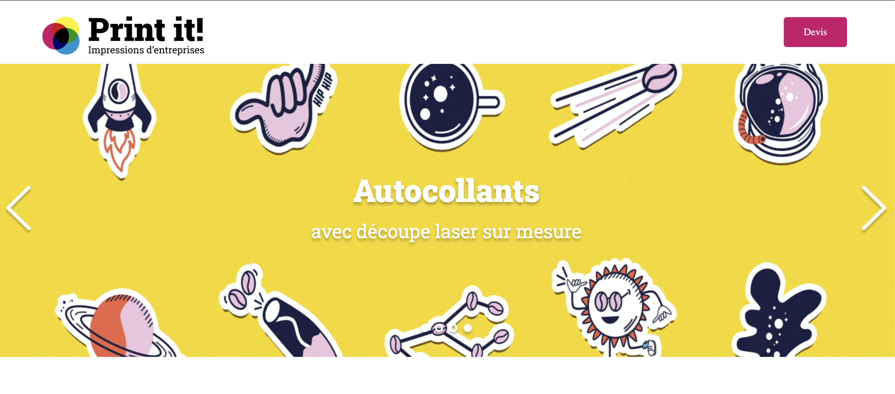

<h1>Print-it Projet 5</h1>

5ème projet du parcours "Intégrateur web" avec Openclassrooms. Mettre à jour une page web existante en lui ajoutant du contenu développé ici avec <b>Javascript</b>. Une entreprise d'imprimerie familiale souhaite implanter un carrousel d'images au désign bien précis. 

<h2>Apercu du projet</h2>

<h2>Technos. utilisées</h2>

HTML / CSS / JAVASCRIPT

<h2>Liens</h2>

Vous pouvez retrouver le lien de la version finale --> <a href="https://ocantoni.github.io/Projet-5/"> ici</a>